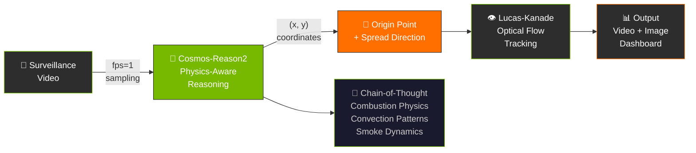
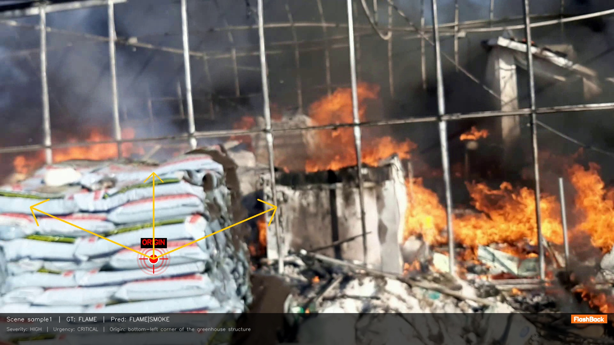
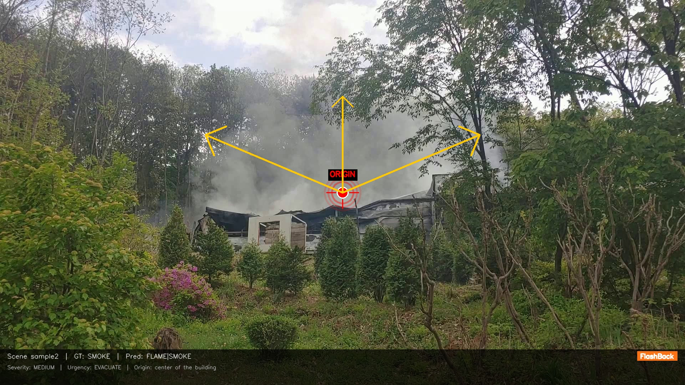

<div align="center">

<br>

# 🔥 FlashBack — Rewinding Fire to Its Origin

**⏪ Physics-Aware Fire Origin Tracing with NVIDIA Cosmos-Reason2**

[](https://docs.nvidia.com/cosmos/latest/reason2/index.html)
[](https://python.org)
[](https://pytorch.org)
[](https://luma.com/nvidia-cosmos-cookoff?tk=YSR0A6)

<br>

An AI system that **physically traces fire back to its origin** from surveillance footage,
<br>
powered by **NVIDIA Cosmos-Reason2**'s physical reasoning to understand combustion, convection, and smoke dynamics.
<br><br>
While conventional fire detection asks *"Is there a fire?"*,
<br>
FlashBack answers ***"Where did it start, and how did it spread?"*** 🎯

<br>

</div>

## 🎬 Demo

https://github.com/user-attachments/assets/6f301e0e-a40b-47d1-bcfa-d846151155a1

<br>

## ⚙️ How It Works

FlashBack operates in **three stages**, leveraging Cosmos-Reason2 as a physics-aware video reasoning engine:



<br>

### 🔬 Stage 1 — Physics-Aware Prompting

Cosmos-Reason2 is prompted as a **fire physics expert**. The model analyzes video frame-by-frame, performing Chain-of-Thought reasoning grounded in combustion physics.

> *"The pattern of flames spreading outward and smoke accumulating above indicates a typical growth-phase fire.*
> *The origin is at the lower section where fuel sources are concentrated, spreading upward via thermal convection."*
> — Cosmos-Reason2 CoT reasoning example

### 📍 Stage 2 — Coordinate-Based Origin Tracing

The model outputs the fire origin as **normalized coordinates (x, y)**. It simultaneously infers both a textual description (e.g., "lower-left of the greenhouse") and precise coordinates (0.25, 0.75), which are overlaid on the original frame as an **origin marker + spread direction arrows**.

### 👁️ Stage 3 — Optical Flow Tracking

**Lucas-Kanade optical flow** tracks the origin coordinates across all frames. Even with camera movement, the origin marker stays locked to the correct position, enabling real-time visualization of fire propagation in the demo video.

<br>

### 🧪 Physics Reasoning Principles

| Principle | What the Model Analyzes | How It Traces the Origin |
|:----------|:------------------------|:-------------------------|
| 🌡️ **Convection** | Rising hot air currents, smoke transport paths | Below smoke accumulation point = origin |
| 🔥 **Combustion** | Fuel density vs. flame intensity | Identify initial fuel concentration |
| 💨 **Propagation** | Heat-transfer-driven outward spread | Reverse-trace from the spread center |
| 🌫️ **Smoke Color** | Smoke color → burning material type | Infer origin location + fuel source |
| ⏱️ **Temporal** | Ignition → Growth → Flashover → Decay | Reverse direction from frame changes |

<br>

## 📈 Results

> **Cosmos-Reason2-2B / 8B** &nbsp;|&nbsp; 11 scenes &nbsp;|&nbsp; FLAME 6 / SMOKE 2 / NORMAL 3

| Metric | Score |
|:-------|------:|
| 🎯 Fire Origin Tracing | **100%** |
| ⏱️ Temporal Reasoning | **100%** |
| ↗️ Spread Direction | **85.7%** |

<br>

## 🖼️ Origin Visualization

<table>
<tr>
<td width="50%"><br><sub><b>🔥 sample1 — FLAME</b> · Fire origin + spread direction in greenhouse</sub></td>
<td width="50%"><br><sub><b>🌫️ sample2 — SMOKE</b> · Reverse-tracing origin from smoke dispersion</sub></td>
</tr>
</table>

<br>

## 🚀 Quick Start

```bash
git clone https://github.com/Hann1n/FlashBack.git
cd FlashBack

python -m venv .venv && source .venv/Scripts/activate  # Windows
# source .venv/bin/activate  # Linux/macOS
pip install torch torchvision --index-url https://download.pytorch.org/whl/cu124
pip install -r requirements.txt
```

```bash
# 🔄 Full pipeline
python run.py

# Or step by step
python -m src.core.detection      # 🧠 Cosmos-Reason2 inference (2B/8B, GPU)
python -m src.core.visualize      # 🖼️ Origin overlay images
python -m src.ui.dashboard        # 📊 HTML dashboard
python -m src.core.video           # 🎬 Demo video with optical flow
streamlit run src/ui/app.py       # 🌐 Interactive dashboard
```

<br>

## 📁 Project Structure

```
FlashBack/
├── 🚀 run.py                      # Pipeline entry point
├── 📂 src/
│   ├── config.py                  # Centralized path configuration
│   ├── 🧠 core/                   # Inference & logic
│   │   ├── inference.py           # Cosmos-Reason2 model wrapper
│   │   ├── detection.py           # Fire detection + origin inference
│   │   ├── new_data.py            # New dataset inference pipeline
│   │   ├── visualize.py           # Origin marker visualization
│   │   └── video.py               # Demo video (optical flow tracking)
│   ├── 🖥️ ui/                     # Dashboards & visualization
│   │   ├── app.py                 # Streamlit interactive dashboard
│   │   ├── dashboard.py           # Standalone HTML dashboard
│   │   └── fiftyone_builder.py    # FiftyOne dataset builder
│   └── 🔧 utils/                  # Shared utilities
│       └── common.py              # imread_unicode, origin helpers
├── 📂 data/                       # Local datasets (download separately)
├── 📂 reports/                    # Inference results (JSON)
├── 🎬 demo/                       # Demo video
├── 🖼️ assets/                     # README images
├── requirements.txt
└── README.md
```

<br>

## 🛠️ Technical Stack

| Component | Technology |
|:----------|:-----------|
| 🧠 **Model** | Cosmos-Reason2-2B / 8B (Qwen3VL) |
| 👁️ **Tracking** | Lucas-Kanade Optical Flow |
| 🎥 **Video** | PyAV backend (Windows FFmpeg workaround) |
| ⚡ **Inference** | fps=1, temp=0.6, CoT reasoning enabled |
| 📊 **Visualization** | OpenCV, Plotly, Chart.js, Streamlit |

<br>

<div align="center">

Built with 💚 for [NVIDIA Cosmos Cookoff 2026](https://luma.com/nvidia-cosmos-cookoff?tk=YSR0A6)
<br>
Uses [Cosmos-Reason2](https://docs.nvidia.com/cosmos/latest/reason2/index.html) under NVIDIA Open Model License

</div>
