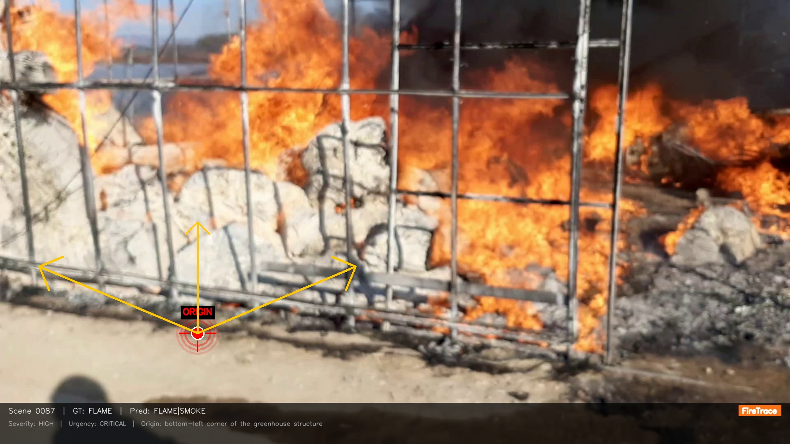
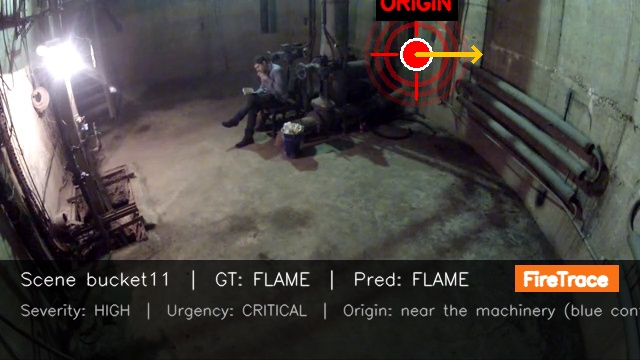
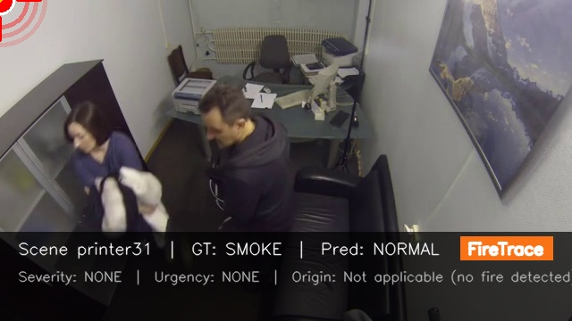
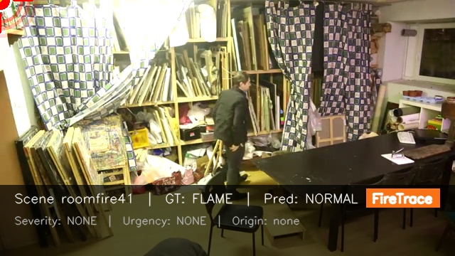
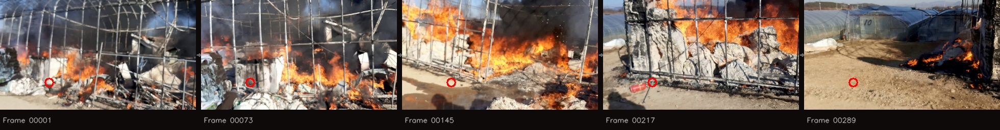

<div align="center">

# FlashBack

### Rewinding Fire to Its Origin

**감시 영상에서 화재 발원지를 물리적으로 역추적하는 AI 시스템**

[](https://build.nvidia.com/nvidia/cosmos-reason2)
[](https://python.org)
[](https://pytorch.org)
[](https://www.nvidia.com/en-us/ai/cosmos-cookoff/)

<br>

기존 화재 감지: *"불이 있는가?"*
<br>
**FlashBack**: ***"불이 어디서 시작되어, 어떻게 퍼졌는가?"***

<br>

</div>

## Demo

<https://github.com/Hann1n/flashback/raw/master/demo/firetrace_demo.mp4>

> Lucas-Kanade 광학 흐름으로 화재 발원지를 프레임마다 추적하며 확산 과정을 시각화합니다.

## Fire Origin Tracing

<table>
<tr>
<td width="50%">



**Scene 0087 — FLAME**
<br>온실 화재의 발원지와 확산 방향 추적

</td>
<td width="50%">


**Scene 0096 — SMOKE**
<br>연기 확산 패턴에서 발원지 역추적

</td>
</tr>
</table>

<table>
<tr>
<td><br><sub>bucket11 — 실내 화재</sub></td>
<td><br><sub>printer31 — 프린터 화재</sub></td>
<td><br><sub>roomfire41 — 실내 대형 화재</sub></td>
</tr>
</table>

### Temporal Progression



> 시간 순서로 배열된 프레임. 빨간 원이 각 프레임에서의 발원지 위치를 표시합니다.

## Results

> Cosmos-Reason2-2B | 11개 장면 (FLAME 5 / SMOKE 2 / NORMAL 4)

| Metric | Score | Description |
|:-------|:-----:|:------------|
| **Fire Origin Tracing** | **100%** | 화재 장면에서 발원지 좌표를 모두 추론 |
| **Temporal Reasoning** | **100%** | 모든 장면에서 시간적 화재 진행을 분석 |
| **Spread Direction** | **85.7%** | 확산 방향 + 화살표 좌표 추론 |
| **Hazard Detection** | **71.4%** | 화재/연기 위험 감지 |

## How It Works

```
┌──────────────────────────────────────────────────────────────────┐
│                     FlashBack Pipeline                           │
│                                                                  │
│  ┌──────────┐    ┌────────────────┐    ┌───────────────────┐    │
│  │ 감시 영상 │───▶│  Cosmos-Reason2 │───▶│ 발원지 좌표 (x,y) │    │
│  │ (MP4/JPG) │    │  Physics VLM   │    │ + 확산 화살표     │    │
│  └──────────┘    └────────────────┘    └─────────┬─────────┘    │
│                         │                         │              │
│                  ┌──────▼──────┐          ┌───────▼────────┐    │
│                  │ Chain-of-   │          │ Lucas-Kanade   │    │
│                  │ Thought     │          │ Optical Flow   │    │
│                  │ 물리 추론    │          │ 프레임 간 추적   │    │
│                  └─────────────┘          └───────┬────────┘    │
│                                                   │              │
│                                           ┌───────▼────────┐    │
│                                           │ 시각화 + 데모   │    │
│                                           │ Origin Overlay  │    │
│                                           └────────────────┘    │
└──────────────────────────────────────────────────────────────────┘
```

### Physics-Based Reasoning

FlashBack은 Cosmos-Reason2의 물리 추론을 통해 발원지를 역추적합니다:

| Physics Principle | Analysis | Origin Tracing |
|:-----------------|:---------|:---------------|
| **Convection** | 열기류 상승 → 연기 위로 운반 | 연기 축적점 아래 = 발원지 |
| **Combustion** | 연료 밀도 ↔ 화염 강도 상관 | 최초 연료 집중 지점 특정 |
| **Flame Propagation** | 열전달에 의한 외부 확산 | 확산 중심점 역추적 |
| **Smoke Analysis** | 연기 색상 → 연소 물질 특성 | 발원 위치 + 연료 추정 |
| **Temporal Dynamics** | 발화 → 성장 → 최성기 → 쇠퇴 | 프레임 변화로 확산 방향 역산 |
| **Optical Flow** | Lucas-Kanade 프레임 추적 | 카메라 이동에 따른 좌표 보정 |

## Quick Start

### Requirements

- Python 3.12+, NVIDIA GPU (16GB+ VRAM), CUDA 12.4+

### Install

```bash
git clone https://github.com/Hann1n/flashback.git
cd flashback

python -m venv .venv && .venv\Scripts\activate

pip install torch torchvision --index-url https://download.pytorch.org/whl/cu124
pip install -r requirements.txt
```

### Run

```bash
# Full pipeline (visualization → dashboard → FiftyOne)
python run_firetrace.py

# Or step by step:
python fire_detection.py          # 1. Cosmos-Reason2 inference (GPU)
python visualize_origin.py        # 2. Origin marker images
python firetrace_dashboard.py     # 3. HTML dashboard
python make_firetrace_video.py    # 4. Demo video with optical flow
streamlit run firetrace_app.py    # 5. Interactive dashboard
python firetrace_fiftyone.py      # 6. FiftyOne dataset explorer
```

## Architecture

```
flashback/
├── inference.py               # Cosmos-Reason2 model wrapper (PyAV backend)
├── fire_detection.py          # Inference + evaluation with coordinate output
├── firetrace_new_data.py      # New dataset inference pipeline
├── visualize_origin.py        # Origin marker + spread arrows visualization
├── firetrace_dashboard.py     # Chart.js HTML dashboard generator
├── firetrace_app.py           # Streamlit interactive dashboard
├── firetrace_fiftyone.py      # FiftyOne dataset builder
├── make_firetrace_video.py    # Demo video with optical flow tracking
├── run_firetrace.py           # Complete pipeline runner
├── reports/                   # Results + visualizations
│   ├── results_combined.json  # Inference results (11 scenes)
│   ├── origin_*.jpg           # Origin overlay images
│   └── temporal_*.jpg         # Temporal progression strips
├── demo/
│   └── firetrace_demo.mp4     # Demo video
├── data/                      # Datasets (not included, see below)
└── requirements.txt
```

### Data Setup

Place fire datasets in `data/`:
```
data/
├── fire_dataset/              # AIHub Fire Detection Dataset
│   └── Sample/01.원천데이터/화재현상/
└── fire_videos/               # Additional fire surveillance videos (MP4)
```

## Technical Details

| Component | Implementation |
|:----------|:---------------|
| **Model** | Cosmos-Reason2-2B (Qwen3VL architecture) |
| **Video Backend** | PyAV monkey-patch (Windows FFmpeg DLL workaround) |
| **Origin Tracking** | Lucas-Kanade Optical Flow (OpenCV) |
| **Unicode Paths** | `np.fromfile` + `cv2.imdecode` for Korean paths |
| **Inference** | fps=1, temperature=0.6, top_k=20, max_tokens=1024 |
| **Reasoning** | Chain-of-Thought enabled (`<think>` tags) |
| **Coordinate Fallback** | Text-to-coordinate parser when model omits coords |

## License

Built for [NVIDIA Cosmos Cookoff 2026](https://www.nvidia.com/en-us/ai/cosmos-cookoff/).
Uses NVIDIA Cosmos-Reason2 under the [NVIDIA Open Model License](https://www.nvidia.com/en-us/agreements/enterprise-software/nvidia-open-model-license/).
