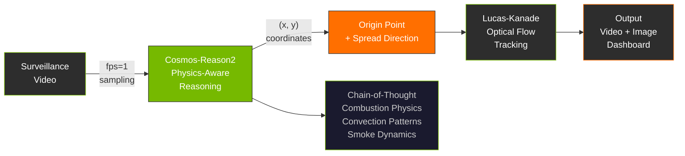

<div align="center">

<br>

# FlashBack

**Rewinding Fire to Its Origin**

[](https://build.nvidia.com/nvidia/cosmos-reason2)
[](https://python.org)
[](https://pytorch.org)
[](https://www.nvidia.com/en-us/ai/cosmos-cookoff/)

<br>

An AI system that **physically traces fire back to its origin** from surveillance footage.
<br>
While conventional fire detection asks *"Is there a fire?"*,
<br>
FlashBack answers ***"Where did it start, and how did it spread?"***

<br>

</div>

## Demo

https://github.com/user-attachments/assets/6f301e0e-a40b-47d1-bcfa-d846151155a1

<br>

## How It Works

FlashBack operates in **three stages**, leveraging Cosmos-Reason2 as a physics-aware video reasoning engine:



<br>

### Stage 1 — Physics-Aware Prompting

Cosmos-Reason2 is prompted as a **fire physics expert**. The model analyzes video frame-by-frame, performing Chain-of-Thought reasoning grounded in combustion physics.

> *"The pattern of flames spreading outward and smoke accumulating above indicates a typical growth-phase fire.*
> *The origin is at the lower section where fuel sources are concentrated, spreading upward via thermal convection."*
> — Cosmos-Reason2 CoT reasoning example

### Stage 2 — Coordinate-Based Origin Tracing

The model outputs the fire origin as **normalized coordinates (x, y)**. It simultaneously infers both a textual description (e.g., "lower-left of the greenhouse") and precise coordinates (0.25, 0.75), which are overlaid on the original frame as an **origin marker + spread direction arrows**.

### Stage 3 — Optical Flow Tracking

**Lucas-Kanade optical flow** tracks the origin coordinates across all frames. Even with camera movement, the origin marker stays locked to the correct position, enabling real-time visualization of fire propagation in the demo video.

<br>

### Physics Reasoning Principles

| Principle | What the Model Analyzes | How It Traces the Origin |
|:----------|:------------------------|:-------------------------|
| **Convection** | Rising hot air currents, smoke transport paths | Below smoke accumulation point = origin |
| **Combustion** | Fuel density vs. flame intensity | Identify initial fuel concentration |
| **Propagation** | Heat-transfer-driven outward spread | Reverse-trace from the spread center |
| **Smoke Color** | Smoke color → burning material type | Infer origin location + fuel source |
| **Temporal** | Ignition → Growth → Flashover → Decay | Reverse direction from frame changes |

<br>

## Results

> **Cosmos-Reason2-2B** &nbsp;|&nbsp; 11 scenes &nbsp;|&nbsp; FLAME 5 / SMOKE 2 / NORMAL 4

| Metric | Score |
|:-------|------:|
| Fire Origin Tracing | **100%** |
| Temporal Reasoning | **100%** |
| Spread Direction | **85.7%** |

<br>

## Origin Visualization

<table>
<tr>
<td width="50%"><br><sub><b>Sample1 — FLAME</b> · Fire origin + spread direction in greenhouse</sub></td>
<td width="50%"><br><sub><b>Sample2 — SMOKE</b> · Reverse-tracing origin from smoke dispersion</sub></td>
</tr>
</table>

<br>

## Quick Start

```bash
git clone https://github.com/Hann1n/FlashBack.git
cd FlashBack

python -m venv .venv && .venv\Scripts\activate
pip install torch torchvision --index-url https://download.pytorch.org/whl/cu124
pip install -r requirements.txt
```

```bash
# Full pipeline
python run.py

# Or step by step
python src/detection.py          # Cosmos-Reason2 inference (GPU)
python src/visualize.py          # Origin overlay images
python src/dashboard.py          # HTML dashboard
python src/video.py              # Demo video with optical flow
streamlit run src/app.py         # Interactive dashboard
```

<br>

## Project Structure

```
FlashBack/
├── run.py                         # Pipeline entry point
├── src/
│   ├── config.py                  # Centralized path configuration
│   ├── core/                      # Inference & logic
│   │   ├── inference.py           # Cosmos-Reason2 model wrapper
│   │   ├── detection.py           # Fire detection + origin inference
│   │   ├── new_data.py            # New dataset inference pipeline
│   │   ├── visualize.py           # Origin marker visualization
│   │   └── video.py               # Demo video (optical flow tracking)
│   ├── ui/                        # Dashboards & visualization
│   │   ├── app.py                 # Streamlit interactive dashboard
│   │   ├── dashboard.py           # Standalone HTML dashboard
│   │   └── fiftyone_builder.py    # FiftyOne dataset builder
│   └── utils/                     # Shared utilities
│       └── common.py              # imread_unicode, origin helpers
├── data/                          # Local datasets (download separately)
├── reports/                       # Inference results (JSON)
├── demo/                          # Demo video
├── assets/                        # README images
├── requirements.txt
└── README.md
```

<br>

## Technical Stack

| Component | Technology |
|:----------|:-----------|
| **Model** | Cosmos-Reason2-2B (Qwen3VL) |
| **Tracking** | Lucas-Kanade Optical Flow |
| **Video** | PyAV backend (Windows FFmpeg workaround) |
| **Inference** | fps=1, temp=0.6, CoT reasoning enabled |
| **Visualization** | OpenCV, Plotly, Chart.js, Streamlit |

<br>

<div align="center">

Built for [NVIDIA Cosmos Cookoff 2026](https://www.nvidia.com/en-us/ai/cosmos-cookoff/)
<br>
Uses [Cosmos-Reason2](https://build.nvidia.com/nvidia/cosmos-reason2) under NVIDIA Open Model License

</div>
